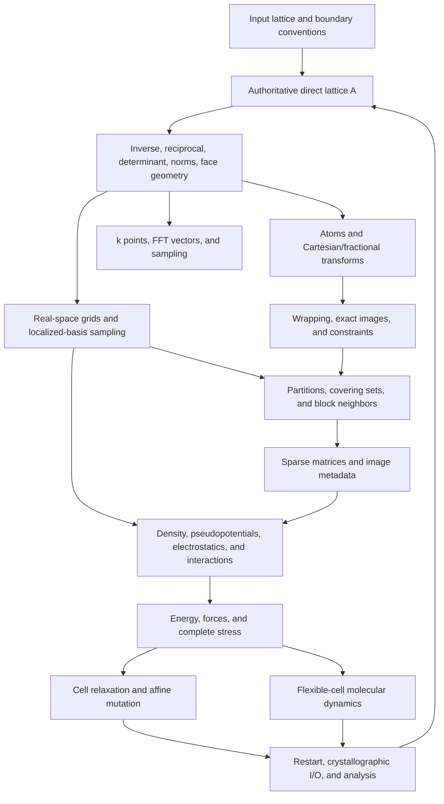

# General-cell geometry in CONQUEST

## Design principles, subsystem roadmap, and validation strategy

**Author and fork maintainer:** Augustin Lu<br>
**Status:** Experimental-fork technical design reference<br>
**Audience:** Developers maintaining or independently implementing general-cell
support in CONQUEST<br>
**Last updated:** 2026-08-12

> [!IMPORTANT]
> This document describes engineering principles and implementation experience
> from the experimental general-cell branch maintained in the Augustin Lu
> CONQUEST fork. It is not an official CONQUEST development roadmap, does not
> imply upstream acceptance, and does not claim that every CONQUEST feature is
> validated for nonorthogonal cells.

## 1. Purpose

Supporting a general periodic cell is not a local input-format change. An
orthorhombic implementation can encode the cell implicitly as three independent
Cartesian lengths in grid construction, reciprocal sampling, periodic images,
spatial decomposition, matrix reuse, electrostatics, stress, relaxation,
molecular dynamics, restart, and analysis. Once the lattice vectors are allowed
to be nonorthogonal, those independent scalar operations cease to describe a
coherent geometry.

This document provides a durable technical direction for replacing those
assumptions. Its goals are to:

- define one direct- and reciprocal-lattice convention;
- distinguish geometric quantities that coincide only in orthorhombic cells;
- identify the major CONQUEST subsystems affected by a general cell;
- establish a dependency-ordered implementation roadmap;
- explain maintainable interfaces and update ownership;
- define validation evidence appropriate to each layer;
- record capability boundaries so that partial support is not overclaimed.

The intended result is a coherent geometry system. Every consumer receives the
physical quantity it actually needs, every cell change updates one consistent
state, and every supported capability has a diagnostic test.

## 2. Scope and non-goals

The core scope is a three-dimensional direct lattice with arbitrary nonsingular
vectors, including rotated orthogonal, tetragonal, hexagonal, rhombohedral,
monoclinic, and triclinic representations. The design also covers one- and
two-dimensional periodic calculations embedded in a three-vector simulation
cell, provided the specialist boundary-condition path is tested explicitly.

The architectural scope includes:

- direct and reciprocal lattice state;
- Cartesian/fractional transformations;
- real- and reciprocal-space grids;
- periodic wrapping and closest-image geometry;
- spatial ownership, covering sets, and neighbor construction;
- matrix image metadata and restart;
- electrostatics and specialist interaction paths;
- forces and the complete symmetric stress tensor;
- affine cell relaxation and constrained lattice scaling;
- flexible-cell molecular dynamics;
- crystallographic I/O and trajectory analysis;
- serial, MPI, numerical-derivative, and material validation.

This document does **not** claim universal support for every combination of
exchange, correlation, spin, spin-orbit coupling, DFT+U, exact exchange,
order-N algorithms, basis type, boundary condition, or external field. A
general geometric foundation makes those combinations possible; it does not
validate them automatically.

## 3. Central mathematical convention

### 3.1 Direct lattice

Let the direct lattice be the matrix

```text
A = [ a1  a2  a3 ]
```

whose **columns** are the three Cartesian direct-lattice vectors. Fractional
coordinates `s` and Cartesian coordinates `r` are related by

```text
r = A s
s = A^-1 r
```

The signed determinant records orientation, while its magnitude is the
physical cell volume:

```text
V_signed = det(A)
V = abs(det(A))
```

Array layout at an input, output, or library boundary may use rows instead of
columns. That is an interface convention, not a reason to change the internal
mathematics. Every boundary must state whether vectors are rows or columns and
perform the transpose in one visible place.

### 3.2 Reciprocal lattice

For fractional reciprocal coordinates `q`, the Cartesian wave vector is

```text
B = 2 pi A^-T
k = B q
q = A^T k / (2 pi)
```

Some internal interfaces store `A^-T` without the factor `2 pi`. This is valid
only when the interface name and documentation make the convention explicit.
The reciprocal basis cannot be reconstructed by dividing Cartesian components
by three direct-vector lengths.

### 3.3 Metric and cell-face geometry

The direct metric is

```text
G = A^T A
```

and determines lengths and angles in fractional coordinates. The covector
normal to the pair of faces perpendicular to lattice direction `i` is column
`i` of `A^-T`. Therefore

```text
face-normal height h_i = 1 / norm(A^-T[:,i])
face area S_i = V / h_i
```

For Cartesian position `r`, a wrapped physical coordinate measured along that
face normal is

```text
z_i(r) = modulo((A^-T[:,i]) dot r, 1) * h_i
```

The direct-vector length `norm(a_i)` and face-normal height `h_i` are equal in
an axis-aligned orthorhombic cell. They are different in a skew cell and serve
different purposes.

### 3.4 Real-space grid

For grid counts `N1`, `N2`, and `N3`, the point with integer indices `n` is

```text
r_grid(n) = A (n1/N1, n2/N2, n3/N3)
dV_grid = abs(det(A)) / (N1 N2 N3)
```

It is useful to cache the three Cartesian grid-step vectors

```text
g_i = a_i / N_i
```

but they must remain derived state. Grid origins, block corners, PAO sampling,
pseudopotential projectors, density points, and real-space force moments should
all use the same grid geometry.

### 3.5 Periodic images

An integer image vector `n` represents the Cartesian translation

```text
T(n) = A n
```

Periodic image metadata should therefore be stored as integer lattice counts
where practical. Storing three already-expanded Cartesian offsets risks stale
state after a cell change and silently assumes that image directions remain
axis aligned.

Fractional wrapping and the minimum-image convention are distinct operations:

- wrapping maps a point into a chosen primitive parallelepiped;
- minimum image returns the shortest Euclidean displacement among all periodic
  translations.

For wrapping into `[0,1)`:

```text
s_wrapped = s - floor(s)
r_wrapped = A s_wrapped
```

This operation should be implemented by one canonical helper with the strict
postcondition `0 <= s_wrapped < 1` for every component. In finite-precision
arithmetic, subtracting `floor(s)` can round to exactly `1.0` when `s` is a
small negative number. The helper must normalize that boundary result to the
chosen representation of the periodic seam and use the same seam tolerance as
the ownership and grid-mapping routines. This prevents a mathematically valid
periodic coordinate from becoming an out-of-range array index.

For a skew or unreduced lattice, independently rounding the three fractional
components does **not** always give the closest Cartesian image.

### 3.6 Cell strain

For a small Cartesian strain `epsilon`, the lattice transforms by left action:

```text
A' = (I + epsilon) A
```

A rotation-free cell degree of freedom uses a symmetric strain tensor. A
reciprocal vector transforms covariantly:

```text
k' = (I + epsilon)^-T k
```

Finite-difference stress checks must state whether an off-diagonal parameter is
a tensor shear or an engineering shear. The analytic and numerical conventions
must use the same factor of two.

## 4. Quantities that must remain distinct

| Quantity | Correct uses | Invalid substitutes |
|---|---|---|
| `norm(a_i)` | reporting, some direct-grid index bounds | face-normal height, reciprocal sampling |
| `h_i = 1/norm(A^-T[:,i])` | surface height, SFC physical span, face-normal coordinates | direct-vector length |
| `abs(det(A))` | integration, density normalization, polarization, vdW and stress normalization | product of vector lengths |
| `A^-1` | Cartesian-to-fractional conversion | component-wise division by lengths |
| `A^-T` | reciprocal transforms and face normals | diagonal inverse-length matrix |
| integer image `n` | reconstructing `A n`, restart, matrix-image identity | Cartesian `(nx Lx, ny Ly, nz Lz)` |
| fractional wrapping | canonical position in the primitive cell | closest Euclidean periodic image |
| exact minimum image | shortest periodic displacement | independent fractional rounding |
| Cartesian AABB | conservative broad-phase filter | exact skew-block distance |

Many general-cell defects arise from using a mathematically valid quantity in
the wrong semantic role. Naming and ownership should make those substitutions
difficult.

## 5. Authoritative state and invariants

### 5.1 One source of truth

The direct lattice `A` is authoritative. The inverse, reciprocal basis,
determinant, volume, vector norms, face heights, grid steps, and related bounds
are derived. Compatibility scalars may be exposed to legacy code, but they must
not become a second cell representation.

### 5.2 Required invariants

After initialization and after every accepted cell mutation:

- `A^-1 A` is the identity within a documented tolerance;
- reciprocal state equals `A^-T` under the selected `2 pi` convention;
- each cached vector length equals the norm of its direct-lattice column;
- physical volume equals `abs(det(A))`;
- the determinant is finite, nonsingular, and has the accepted handedness;
- Cartesian and fractional atomic positions represent the same points;
- wrapped fractional coordinates satisfy the declared half-open interval;
- k points and FFT reciprocal vectors retain their fractional meaning;
- the density integral preserves electron count after volume changes;
- all MPI ranks hold identical lattice and derived state;
- every lattice-dependent cache is rebuilt, invalidated, or proven reusable.

Invariant checks should be cheap enough to enable in debug builds. They localize
state corruption near the update that caused it rather than allowing a later
SCF or MPI failure to obscure the origin.

### 5.3 Transactional cell mutation

A cell change is a transaction, not a sequence of unrelated assignments. A
safe high-level sequence is:

1. Save the old lattice and all state needed for rollback.
2. Express atoms and other covariant state in fractional coordinates.
3. Construct and validate the trial lattice.
4. Refresh inverse, reciprocal, determinant, volume, norms, and grid geometry.
5. Reconstruct Cartesian atoms and reciprocal vectors from preserved fractional
   values.
6. Rescale or regenerate density state so that electron number is conserved.
7. Rebuild partitions, images, neighbor data, Ewald state, and other
   lattice-dependent caches.
8. Validate invariants on every MPI rank.
9. Commit the trial state, or restore the complete old state on failure.

Partial updates are especially dangerous because they can produce finite,
apparently reasonable energies from mutually inconsistent geometry.

## 6. Architectural dependency graph



The arrows define a natural implementation and debugging order. A downstream
test cannot compensate for an ambiguous upstream convention.

## 7. Subsystem design

### 7.1 Input, initialization, and MPI synchronization

Input accepts three complete lattice vectors and converts the external row or
column convention at one boundary. Initialization should compute all derived
geometry through one routine before any consumer runs. MPI broadcasts must
include the complete lattice and enough authoritative state for every rank to
reconstruct or verify the same derived values.

Input validation should reject singular, non-finite, and unsupported-handedness
cells before allocating large arrays. Tolerances should be based on physical
scale or matrix conditioning rather than a fixed absolute determinant alone.

### 7.2 Reciprocal space, FFT geometry, and sampling

Every reciprocal vector begins as an integer or fractional reciprocal triplet
and is transformed with `A^-T`. This applies to:

- user-specified and automatic k points;
- Monkhorst-Pack meshes;
- band paths;
- FFT reciprocal vectors;
- reciprocal cutoffs and response derivatives;
- phase factors and polarization quantities.

Automatic FFT index bounds and automatic k-point sampling use different
geometric information. Direct-vector lengths can bound a real-space grid index
box, whereas reciprocal-vector lengths control k-space spacing. Strongly skewed
equivalent cells are useful for detecting an accidental exchange of these
roles.

A Monkhorst-Pack mesh is attached to the reciprocal basis of the supplied
lattice. The construction remains geometrically valid for an unreduced cell,
but the resulting mesh can be poorly conditioned or unnecessarily expensive.
The code should diagnose strongly unreduced or ill-conditioned inputs and let
the user provide a reduced primitive representation. An optional automatic
Niggli- or Minkowski-reduction path would have to be explicit: it must transform
the lattice, fractional atoms, symmetry operations, mesh shifts, band-path
coordinates, and output mapping as one operation. Silent reduction inside the
k-point generator would change user-visible reciprocal coordinates and break
the ownership boundary of that subsystem. Equivalent-cell sampling tests
should cover both ordinary and deliberately unreduced bases.

### 7.3 Real-space integration and localized-basis geometry

Block origins and point offsets are vector combinations of lattice grid steps.
All consumers should call common helpers rather than reproduce matrix products
inside deeply nested loops. Candidate consumers include density, PAO and blip
transforms, local and nonlocal pseudopotentials, overlap matrices, and
grid-dependent force terms.

For tensor-product blip functions, the scalar value is invariant under a
coordinate transform, while gradients and Hessians require the first- and
second-derivative chain rules. A successful scalar calculation does not prove
that optimized support functions or force derivatives are correct.

OpenMP clauses require a dedicated audit after introducing vector temporaries.
A geometrically correct loop can remain nondeterministic if new local arrays are
accidentally shared.

### 7.4 Exact periodic geometry

The closest periodic image may be found by starting from the rounded
fractional candidate and constructing a finite search bound from the row norms
of `A^-1`. If a Cartesian residual shorter than `R` is sought, each fractional
component of that residual is bounded by the corresponding inverse-row norm
times `R`. This produces a complete integer search region without relying on a
fixed `[-1,1]^3` cube.

The implementation should define deterministic tie behavior and guard integer
candidate counts against overflow. Highly unreduced cells may be expensive;
lattice reduction or cached bounds can be added later without weakening the
correctness rule.

Constraints, RDF, MSD, matrix reuse, dispersion, and neighbor construction
should use the same exact displacement semantics when they require a closest
image.

### 7.5 Spatial decomposition and atom ownership

Ownership is naturally defined in wrapped fractional coordinates. Physical
cutoff distances remain Cartesian. This separation supports skew cells without
making a Cartesian bounding box authoritative.

Boundary tolerances expressed in Bohr must be converted to fractional
tolerances using the relevant face-normal height. Ownership at an exact
periodic boundary must be deterministic across ranks.

Space-filling-curve dimensions should represent physical spans normal to cell
faces, not the Cartesian AABB or direct-vector lengths. Bulk, slab, and wire
classification must use the same lattice-direction semantics.

### 7.6 Covering sets and block-neighbor geometry

Cover and primary translations are complete vectors `A n`. A skew integration
block is a parallelepiped. Its eight-corner Cartesian AABB is useful as a cheap
broad-phase filter, but the AABB can contain points outside the physical block.

An exact point-to-parallelepiped distance can be evaluated as a small bounded
quadratic problem over the block coordinates. One robust approach enumerates
the active lower, free, and upper state of each of the three block coordinates,
solves the corresponding Gram systems, and selects the feasible minimum. The
exact predicate used for maximum count, allocation, and fill passes must be
identical. A mismatch can corrupt allocation counts, communication state, and
memory safety.

### 7.7 Sparse matrices, image metadata, and restart

Matrix entries associated with periodic neighbors need image identity that
survives communication, reuse, restart, and cell changes. Integer lattice-image
counts are preferable to expanded Cartesian translations. Local and remote
reconstruction must use the same orientation convention.

When deciding whether a matrix can be reused after a cell change, separate
affine lattice motion from residual ionic motion. Comparing raw Cartesian
displacements can falsely classify atoms as having moved even when their
fractional coordinates are unchanged.

Restart compatibility requires an explicit policy. Legacy three-length fields
may be retained for old files, but new restart state must preserve the complete
lattice and any cell-dynamic variables needed for exact continuation.

### 7.8 Electrostatics and specialist interactions

Ewald, pseudopotential, polarization, dispersion, vdW, slab correction, and
exact-exchange paths each need a feature-specific audit. Typical failure modes
include:

- passing only three vector norms to an interaction routine;
- retaining a volume equal to a product of lengths;
- using Cartesian coordinate ratios in polarization phases;
- keeping Ewald arrays built for a previous trial lattice;
- applying a surface correction along a Cartesian axis rather than a face
  normal;
- updating a compatibility spacing without generalizing the underlying
  algorithm.

Ewald accuracy parameters should remain immutable input policy, while
cell-dependent working arrays are rebuilt after an accepted or trial cell
change as required. Specialist support should be claimed only after its own
invariance or finite-difference test.

### 7.9 Forces and complete stress

A general cell requires all six independent components of the symmetric
Cartesian stress tensor. Off-diagonal terms must be audited in local, nonlocal,
Hartree, exchange-correlation, pseudopotential, Pulay, ionic, and grid-dependent
contributions.

The internal representation is a full `3 x 3` Cartesian matrix for stress,
strain, cell velocity, and cell force. Symmetry should be checked or enforced at
named interface boundaries. A six-component form may be used for input, output,
or numerical checks only when its order is stated explicitly; the recommended
order is `(xx, yy, zz, yz, xz, xy)`. Such an interface must also state whether
its shear entries are tensor components or engineering shear. In particular,
`gamma_xy = 2 epsilon_xy`, whereas the matrix exponential in the flexible-cell
update consumes the tensor matrix directly and must not receive a Voigt or
engineering-shear factor.

The static and kinetic quantities also have separate owners. The DFT force path
provides the static cell derivative or virial in energy units. Under the current
CONQUEST sign convention, the MD layer constructs the ionic kinetic virial

```text
K = sum_i m_i v_i (v_i)^T
```

and forms its pressure-driving tensor from `(K - stress_DFT) / V`. The MD layer
must keep this assembly separate from the static DFT result, and every output or
API should state whether it contains the static virial, the kinetic term, or the
combined tensor.

The stress convention, sign, volume normalization, tensor index order, and
off-diagonal strain parameterization must be written beside the numerical
checker. Validation should include:

- each of the six isolated symmetric strains;
- a deliberately distorted low-symmetry cell;
- separate ionic/Ewald and total DFT checks;
- symmetry of the printed tensor;
- a rotated orthogonal cell, which can require off-diagonal Cartesian stress
  even though its metric is orthogonal.

### 7.10 Cell relaxation

Different optimization methods have different geometric capabilities and
should remain explicit:

- a full symmetric-strain method can change lengths and angles;
- a lattice-vector scale method can support nonorthogonal cells while
  preserving their reference angles;
- constrained methods may expose volume, axial, in-plane, or full symmetric
  degrees of freedom.

Trial steps must use the transactional update described above. Backtracking
should reject singular or negative-volume trials, non-finite energies, and
insufficient descent without leaving partially updated state.

Equivalent-cell EOS comparisons, full stress finite differences, monoclinic
relaxation, and fixed-angle HCP relaxation diagnose different parts of the
implementation and should not be collapsed into one pass/fail statement.

### 7.11 Flexible-cell molecular dynamics

A rotation-free flexible cell can be represented through symmetric strain,
cell velocity, and cell force matrices. A matrix exponential is a natural
finite update:

```text
A(t + dt) = exp(dt D) A(t)
```

with symmetric `D` for pure strain. Supported constraint subspaces should be
defined mathematically and validated at input time. Examples include fixed,
volume-only, Cartesian-normal (`xyz`), in-plane symmetric (`xy`), and full
symmetric motion.

Restart must preserve every independent cell coordinate, velocity, force, and
thermostat/barostat variable required for deterministic continuation. A short
trajectory can validate mechanics, constraints, and restart identity; it does
not validate long-time ensemble sampling.

### 7.12 Crystallographic I/O and analysis

Every format has different representational limits:

- native coordinate and MD-frame formats should retain all three vectors;
- extended XYZ should write the complete lattice and correctly normalized
  stress;
- XSF trajectories need a complete `PRIMVEC` for each variable-cell frame;
- PDB `CRYST1` preserves lengths and angles but not arbitrary Cartesian
  orientation;
- PDB `SCALE1`-`SCALE3` records can preserve the reciprocal transform required
  for an oriented restart.

Trajectory RDF and MSD analysis must use full-lattice periodic geometry.
Variable-cell MSD should distinguish scaled-coordinate motion from affine
barostat deformation so that lattice expansion is not misreported as particle
diffusion.

## 8. Dependency-ordered implementation roadmap

The following work packages are intended to be independently reviewable. Each
package should preserve existing orthorhombic behavior and add one focused
general-cell signal.

| Package | Objective | Exit gate |
|---|---|---|
| 0. Baseline characterization | Establish clean builds, legacy outputs, compiler behavior, and known unsupported cases | Reproducible orthorhombic baseline and named first general-cell failure |
| 1. Lattice kernel | Introduce authoritative `A`, inverse, reciprocal basis, determinant, norms, transforms, and validation | Algebraic round trips and diagonal-cell compatibility |
| 2. Input and initialization | Read, validate, broadcast, and print complete lattice state | Multi-rank state equality and coordinate round trip |
| 3. Reciprocal geometry | Generalize k points, band paths, FFT vectors, and automatic sampling | Primitive/conventional reciprocal equivalence and sampling-bound tests |
| 4. Real-space grids | Generalize grid points, blocks, PAO, pseudo, density, and blip transforms | Orthorhombic control plus skew-cell SCF and derivative-path execution |
| 5. Periodic geometry | Implement wrapping, exact MIC, constraints, and face geometry | Exhaustive MIC and triclinic face-geometry tests |
| 6. Decomposition and neighbors | Generalize ownership, SFC spans, cover/primary translations, and exact block distance | One-/two-rank invariance and count/fill agreement |
| 7. Matrix state and restart | Store integer image identity and affine-aware reuse state | Equivalent-cell matrix behavior and restart round trip |
| 8. Static interactions | Audit Ewald, pseudo shifts, polarization, dispersion, vdW, and specialist paths | Feature-specific invariance or derivative tests |
| 9. Complete stress | Propagate all six components with clear conventions | Six central strain finite differences on low-symmetry cells |
| 10. Transactional cell relaxation | Preserve fractional state and rebuild all cell-dependent data during trial steps | EOS agreement, monoclinic full strain, and HCP fixed-angle relaxation |
| 11. Flexible-cell MD | Implement symmetric cell dynamics, constraints, and restart state | Deterministic NVE/NPT mechanics and restart equivalence |
| 12. I/O and analysis | Preserve complete cells in coordinate, trajectory, PDB, XSF, and Python tools | Rotated-cell restart and full-lattice RDF/MSD tests |
| 13. Acceptance and documentation | Assemble material, MPI, legacy, and capability-boundary evidence | Reproducible tiered runner and documented tolerances |
| 14. Portability and cleanup | Remove debug output, audit OpenMP, compilers, dependencies, and artifacts | Clean multi-compiler build and reviewable repository state |

The roadmap is deliberately ordered from representations to consumers. Broad
mechanical replacement before the lattice kernel is stable makes later failures
harder to diagnose.

## 9. Source ownership map

This map records the principal responsibility of the source areas touched by a
general-cell implementation. File names may evolve; the semantic ownership
should remain recognizable.

| Area | Representative files | General-cell responsibility |
|---|---|---|
| Central geometry | `global_module.f90`, `dimens_module.f90` | authoritative lattice, derived state, transforms, volume, MIC, face and block geometry |
| Input and startup | `io_module.f90`, `initial_read_module.f90`, `initialisation_module.f90` | boundary orientation, validation, reciprocal input, MPI synchronization |
| Reciprocal grid | `fft_module.f90` | integer frequency triplets transformed by `A^-T` |
| Real-space sampling | `density_module.f90`, `PAO_grid_transform_module.f90`, `blip_grid_transform_module.f90`, `pseudo_tm_module.f90`, `pseudopotential.module.f90`, `S_matrix_module.f90` | common grid points, values, gradients, Hessians, phases, and volume elements |
| Ownership and decomposition | `atom_dispenser_module.f90`, `sfc_partitions_module.f90` | wrapped fractional ownership and physical face-normal spans |
| Periodic sets and neighbors | `cover_module.f90`, `primary_module.f90`, `UpdateMember_module.f90`, `UpdateInfo_module.f90`, `set_blipgrid_module.f90` | integer image translations, skew blocks, and consistent count/fill predicates |
| Matrix persistence | `store_matrix_module.f90` | image metadata, affine-aware reuse, and restart compatibility |
| Constraints and interactions | `constraint_module.f90`, `DFT_D2_module.f90`, `ion_electrostatic_module.f90`, `polarisation_module.f90`, `vdWDFT_module.f90`, `exx_module.f90` | exact periodic displacements, determinant normalization, cache lifecycle, and explicit capability limits |
| Forces and cell control | `force_module.f90`, `control.f90`, `move_atoms.module.f90` | complete stress, symmetric strain, transactional cell mutation, and relaxation policy |
| Molecular dynamics | `md_control_module.f90`, `md_misc_module.f90`, `md_model_module.f90`, `XLBOMD_module.f90` | full cell state, constraints, restart, and legacy compatibility views |
| Analysis utilities | `utilities/frame.py`, `utilities/md_analysis.py`, `utilities/md_tools.py` | determinant volume, full-lattice MIC, and variable-cell trajectory semantics |

## 10. Validation strategy

### 10.1 Evidence ladder

No single calculation validates a cross-cutting geometry change. Evidence
should form a ladder whose layers isolate different defect classes.

#### Layer A: algebraic geometry

- `3 x 3` inversion and determinant;
- direct/fractional and reciprocal round trips;
- face height, area, and normal coordinate;
- grid origins and offsets;
- exact MIC against exhaustive enumeration;
- exact point-to-parallelepiped distance;
- symmetric matrix exponential and constraint projection.

#### Layer B: representation invariance

- axis-aligned orthorhombic limit;
- rotated orthogonal representation;
- ordinary primitive nonorthogonal cell;
- determinant-one integer basis transformation;
- severely unreduced but physically equivalent lattice;
- read/write/restart preservation of lattice and fractional atoms.

#### Layer C: numerical derivatives

- analytic ionic force against a coordinate finite difference;
- all six analytic stress components against symmetric strain derivatives;
- isolated Ewald and total DFT stress checked separately;
- documented SCF, grid, and finite-difference tolerances.

#### Layer D: parallel determinism

- one versus multiple MPI ranks for energy, force, stress, and ownership;
- nonempty and deterministic partitions;
- agreement between maximum, count, allocation, and fill passes;
- OpenMP repeatability where threaded paths are enabled.

#### Layer E: material acceptance

- familiar equivalent crystals in primitive and conventional cells;
- anisotropic right-angled controls;
- hexagonal and rhombohedral materials;
- more than one monoclinic ionic material;
- layered bulk and slab systems;
- basis and chemical-diversity regression campaigns.

#### Layer F: dynamics and restart

- NVE energy behavior and timestep dependence;
- isotropic skew-cell shape preservation;
- full symmetric monoclinic cell response;
- in-plane slab constraint with fixed vacuum;
- uninterrupted versus restarted trajectory identity;
- consistent complete lattice across output formats.

### 10.2 Maintained repository tests

The experimental branch currently records the following focused tests. Their
presence is evidence only for their documented inputs and tolerances.

| Tests | Primary purpose |
|---|---|
| [`010`](../../testsuite/test_010_graphite_monoclinic/README.md)-[`015`](../../testsuite/test_015_monoclinic_zro2/README.md) | end-to-end hexagonal, primitive, tetragonal-control, layered, and monoclinic material workflows |
| [`016`](../../testsuite/test_016_exact_minimum_image_triclinic/README.md) | exact MIC in skew and unreduced lattices |
| [`017`](../../testsuite/test_017_nonorthogonal_polarisation_extxyz/README.md)-[`018`](../../testsuite/test_018_nonorthogonal_vdw_graphene/README.md) | polarization, extended XYZ, determinant normalization, and vdW invariance |
| [`019`](../../testsuite/test_019_nonorthogonal_npt_md/README.md)-[`023`](../../testsuite/test_023_hcp_zr_method3_relax/README.md) | short general-cell NPT mechanics, constraints, restart, and fixed-angle relaxation |
| [`024`](../../testsuite/test_024_rhombohedral_graphite_sfc_mpi/README.md) | published acute rhombohedral cell, equivalent setting, SFC, MPI, bands, and pDOS |
| [`025`](../../testsuite/test_025_blip_basis_smoke/README.md)-[`026`](../../testsuite/test_026_nonorthogonal_blip_basis/README.md) | orthorhombic blip baseline and nonorthogonal value/derivative transforms |
| [`027`](../../testsuite/test_027_si_equivalent_cells/README.md) | primitive/conventional Si equivalence and reciprocal-mesh parity |
| [`028`](../../testsuite/test_028_auto_full_stress/README.md)-[`030`](../../testsuite/test_030_triclinic_block_distance/README.md) | automatic full stress, direct/reciprocal sampling bounds, and exact skew-block distance |
| [`031`](../../testsuite/test_031_rotated_triclinic_pdb/README.md)-[`032`](../../testsuite/test_032_triclinic_surface_geometry/README.md) | rotated PDB restart and triclinic surface geometry |

Broad periodic-table tests across SZP, DZP, and TZTP basis families are useful
regression evidence for easy calculations, basis handling, chemistry coverage,
and accidental changes to established outputs. They are not by themselves a
general-cell validation because correlated geometry defects can survive smooth
or chemically plausible results.

### 10.3 What passing tests does and does not mean

Passing the complete ladder supports the statement:

> The implementation behaves consistently for the documented cells, features,
> platforms, and numerical tolerances.

It does not support the statement:

> Every CONQUEST algorithm and every parameter combination is correct for every
> nonsingular lattice.

NVE conservation can demonstrate internal consistency while conserving a
slightly wrong Hamiltonian. Energy and forces can share a convention error.
Smooth EOS curves can contain systematic bias. Independent representations,
finite differences, external-code comparisons, and long-term use reduce these
risks but cannot turn a finite test suite into a proof of universal correctness.

## 11. Maintainability principles

### 11.1 Geometry APIs describe meaning

Prefer named operations such as Cartesian/fractional conversion, grid offset,
face height, exact MIC, and block distance over open-coded matrix expressions.
Call sites should reveal the geometric meaning under review.

### 11.2 Orthorhombic cells are the diagonal limit

The orthorhombic path should be the diagonal special case of the same formulas,
not a permanently separate algorithm. Performance-specific fast paths are
acceptable only when checked against the general result.

### 11.3 Updates have one owner

The routine that accepts a new lattice owns the refresh or invalidation of all
derived state. Future features should register their lattice dependency with
that transaction instead of relying on call-order knowledge.

### 11.4 Exactness before optimization

Conservative AABBs, cached bounds, reduced lattices, and special diagonal paths
can improve performance. They must not replace the exact fallback or change the
accepted neighbor set.

### 11.5 Capability claims follow tests

A norm substitution in an exact-exchange compatibility variable does not prove
general-cell exact exchange. A two-step NPT trajectory does not prove ensemble
statistics. Documentation should distinguish execution gates, regression
signals, numerical validation, and physical validation.

### 11.6 Incidental fixes remain separate

Compiler fixes, library compatibility changes, output cleanup, and build-system
repairs may be necessary during the work. Keeping them in separate commits makes
the geometry argument reviewable and simplifies future rebases.

## 12. Risk register

| Risk | Mitigation | Acceptance boundary |
|---|---|---|
| Competing lattice conventions | one documented matrix convention and boundary transposes | no unexplained transpose or duplicated source of truth |
| Stale derived state | transactional refresh and invariant checks | no accepted cell with mixed old/new geometry |
| Wrong quantity with plausible units | semantic helper names and adversarial skew cells | direct length, face height, reciprocal norm, and determinant tested separately |
| Inexact periodic geometry | exhaustive MIC and exact block-distance controls | no fixed search cube or AABB-only acceptance |
| Parallel count/fill mismatch | shared predicate and rank tests | allocation and fill counts agree exactly |
| Stress sign, index, or shear error | six finite differences on low-symmetry cells | documented numerical tolerance and symmetric tensor |
| Flexible-cell instability | constrained symmetric update and deterministic restart tests | mechanics claim kept separate from ensemble claim |
| Pathological unreduced-cell cost | diagnostics, reduction, and caching as later optimization | correctness retained for every accepted cell |
| Specialist-feature overclaim | feature-specific guards and tests | unsupported combinations documented explicitly |
| Repository bloat | compact machine-readable references and external archives | generated plots, reports, and raw campaigns excluded unless policy requires them |

## 13. Definition of a reviewable implementation

A general-cell implementation is ready for serious review when:

- the direct-lattice convention and every external transpose are documented;
- central state invariants hold after initialization and cell mutation;
- the orthorhombic test suite remains supported;
- algebraic and adversarial geometry tests pass;
- reciprocal and real-space paths agree on the same lattice;
- periodic ownership and neighbor construction are deterministic across ranks;
- analytic forces and all six stress components pass finite differences;
- cell updates preserve fractional atoms, reciprocal meaning, electron count,
  and cache coherence;
- relaxation and MD advertise only their tested degrees of freedom;
- restart and output retain the complete cell;
- unsupported specialist combinations are guarded or documented;
- fast representatives of Evidence Ladder Layers A and B, together with at
  least one compact force or stress finite-difference check from Layer C, run
  in automated continuous integration; expensive MPI, material, compiler, and
  extended derivative matrices run on a scheduled or release gate;
- at least two compilers complete clean builds;
- debug output, scratch artifacts, and obsolete implementations are removed;
- each architectural change can be explained from its invariant and test.

Production acceptance requires additional independent review, platform
exposure, user experience, and project governance beyond this technical gate.

## 14. Guidance for future extensions

When adding a new feature to the general-cell path, answer these questions:

1. Does the feature need a direct vector, a vector norm, a face height, the
   determinant, the inverse lattice, the reciprocal lattice, or an exact image?
2. Is its state authoritative, derived, or cached?
3. What must happen to it when the lattice changes?
4. Does it preserve fractional or Cartesian meaning during an affine update?
5. Does it require complete stress or only energy and force?
6. Which orthorhombic input remains a control?
7. Which skew, rotated, or equivalent representation would expose an axis
   assumption?
8. Can one-/two-rank comparison expose ownership or communication defects?
9. Is a numerical derivative available?
10. What capability claim is justified if the test passes?

If these questions do not have precise answers, the feature is not ready to be
advertised as general-cell compatible.

## 15. Related implementation experience

Generalizing an orthorhombic electronic-structure implementation is difficult
but not unique to CONQUEST.

- Sharma and Suryanarayana developed a dedicated nonorthogonal real-space DFT
  formulation for SPARC, including metric-dependent kinetic operators,
  performance recovery, force consistency, HCP and triclinic materials, and
  comparison with ABINIT: [Comput. Phys. Lett. 2018 / arXiv:1802.01068](https://arxiv.org/abs/1802.01068).
- Ko, Santra, and DiStasio extended a fixed-orthorhombic large-scale exact-
  exchange implementation in Quantum ESPRESSO to general fluctuating cells,
  including a general-cell Poisson solve, stress, and NpH/NpT dynamics:
  [J. Chem. Theory Comput. 17, 7789 (2021)](https://doi.org/10.1021/acs.jctc.0c01194).
- Public BigDFT documentation has historically recorded orthorhombic-only cell
  support, illustrating that the restriction can persist even in mature
  high-performance real-space codes:
  [PyBigDFT unit-cell documentation](https://l_sim.gitlab.io/bigdft-suite/PyBigDFT/build/html/BigDFT.UnitCells.html).

These precedents reinforce two lessons: the transition is an architectural
programme rather than a variable rename, and validation must cover energy,
force, reciprocal space, stress, dynamics, and performance separately.

## 16. Closing perspective

The maintainable core of general-cell support is a small set of ideas applied
consistently:

- one authoritative direct lattice;
- derived inverse, reciprocal, determinant, and semantic geometry;
- fractional coordinates for periodic topology and ownership;
- Cartesian geometry for physical distances and tensors;
- integer lattice images for periodic identity;
- complete symmetric stress for cell mechanics;
- transactional affine updates for changing cells;
- tests matched to the failure mode of each subsystem.

The volume of source changes comes from propagation, not from complicated
linear algebra. Future implementation work should therefore optimize for clear
ownership, narrow interfaces, diagnostic tests, and honest capability claims.
Those properties make a general-cell implementation understandable and
maintainable long after the original development effort.
